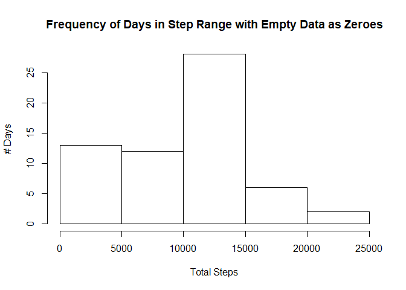

# Reproducible Research: Peer Assessment 1


## Loading and preprocessing the data
For this exercise, the first step to perform is to load the packages planned for use in this analysis. In this instance, the packages to be used are 'dplyr' and 'ggplot2.' If the packages are not already loaded, R will be called to install and load them. 


```r
if("dplyr" %in% rownames(installed.packages()) == FALSE) {
        install.packages("dplyr")
} 
library(dplyr)
```

```
## 
## Attaching package: 'dplyr'
```

```
## The following objects are masked from 'package:stats':
## 
##     filter, lag
```

```
## The following objects are masked from 'package:base':
## 
##     intersect, setdiff, setequal, union
```

```r
if("ggplot2" %in% rownames(installed.packages()) == FALSE) {
        install.packages("ggplot2")
} 
library(ggplot2)
```

```
## Warning: package 'ggplot2' was built under R version 3.4.1
```

After loading the necessary packages, the data used for analysis can then be loaded into R using the read.csv function, as the data file type is .csv. 


```r
unzip("activity.zip")
activity <- read.csv("activity.csv")
```


## What is mean total number of steps taken per day?
In order to determine the mean total number of steps taken per day, the loaded 'activity' data must be transformed to support the calculation of the mean number of steps for each day. To do so, the loaded data is grouped based on day


```r
day_group <- group_by(activity, date)
```

After grouping the data, R can be used to perform a summary calculation of mean, according to the grouping on the 'date' field.


```r
steps_per_day <- summarize(day_group, total_steps = sum(steps, na.rm = TRUE))
```

From this summary variable, we are able to display the average number of steps taken per day:

```r
print(steps_per_day)
```

```
## # A tibble: 61 x 2
##          date total_steps
##        <fctr>       <int>
##  1 2012-10-01           0
##  2 2012-10-02         126
##  3 2012-10-03       11352
##  4 2012-10-04       12116
##  5 2012-10-05       13294
##  6 2012-10-06       15420
##  7 2012-10-07       11015
##  8 2012-10-08           0
##  9 2012-10-09       12811
## 10 2012-10-10        9900
## # ... with 51 more rows
```

The daily step counts can also be summarized through a histogram, showing the freqency with which a step count range occurs in the collected data.


```r
hist(steps_per_day$total_steps, xlab = "Total Steps", ylab = "Days in Range", 
     main = "Steps per Day Frequency")
```

<!-- -->

From this plot, it appears that the most commonly occurring step count range per day is between 10,000 and 15,000 steps. The daily step counts can be further analyzed by calculating their mean and median within the given data.


```r
mean(steps_per_day$total_steps, na.rm = TRUE)
```

```
## [1] 9354.23
```

```r
median(steps_per_day$total_steps, na.rm = TRUE)
```

```
## [1] 10395
```

## What is the average daily activity pattern?
To better understand the average daily activity pattern, the dataset must be grouped on the 5 minute time interval variable.

```r
interval_group <- group_by(activity, interval)
```
Once grouped, the mean number of steps per time interval can be calculated.

```r
avg_per_interval <- summarize(interval_group, avg_steps = mean(steps, na.rm = TRUE))
```
With the data structured along 5 minute intervals, a time series plot can be created, showing how average step count activity changes throughout the day.


```r
plot(avg_per_interval$interval, avg_per_interval$avg_steps, type = "l", 
     xlab = "5 Minute Time Interval", ylab = "Average Steps per Day", 
     main = "Average Daily Step Count (5 Minute Intervals)")
```

<!-- -->

From the plot, we can see that there is a particular time of day with the most average step activity. R can be used to determine the specific 5 minute time interval.


```r
max_step_interval <- filter(avg_per_interval, avg_steps == max(avg_steps))
print(max_step_interval$interval)
```

```
## [1] 835
```
From this, it appears that 8:35 is, on average the most active time of day for steps.

## Imputing missing values
As analysis is performed on this data, it is important to be aware of any aspects of this data which may be missing. For example, there are a number of rows in this dataset which contain NA values.


```r
nulls <- is.na(activity)
nulls_df <- as.data.frame(nulls)
nrow(filter(nulls_df, steps == TRUE))
```

```
## [1] 2304
```
As we are unclear as to the origin of the missing data, this analysis is making the assumption that NA values are equivalent to zeros. Therefore the data is being cleaned to replace these NA values with zeros.

```r
activity_zeroed <- activity
activity_zeroed[is.na(activity_zeroed$steps), 1] <- 0
```

With a new version of the original dataset, an additional histogram can be built to evaluate average daily step counts. Before building the histogram, the newly cleaned data must be grouped and summarized, similar to the earlier actions on the dataset with NA values.


```r
day_group_zeroed <- day_group <- group_by(activity_zeroed, date)
tot_day_zeroed <- summarize(day_group_zeroed, tot_steps = sum(steps, na.rm = TRUE))
hist(tot_day_zeroed$tot_steps, xlab = "Total Steps", ylab = "# Days", 
     main = "Frequency of Days in Step Range with Empty Data as Zeroes")
```

<!-- -->

Finally, calculate the mean and median of this cleansed dataset

```r
mean(tot_day_zeroed$tot_steps, na.rm = TRUE)
```

```
## [1] 9354.23
```

```r
median(tot_day_zeroed$tot_steps, na.rm = TRUE)
```

```
## [1] 10395
```
By taking this cleansing approach, the mean and median values remain exactly the same as the original dataset.

## Are there differences in activity patterns between weekdays and weekends?
In order to perform an evaluation of the data based on whether the activity occurred on a weekday or weekend, the dataset must be transformed to identify the 'date' variable as a date class.

```r
activity_zeroed$date <- as.Date(activity_zeroed$date)
```

Then a new data frame is created, adding a column which identifies the day of the week of the date value in that particular row.


```r
weekday <- mutate(activity_zeroed, weekday = weekdays(activity_zeroed$date))
```

With the additional column now mapping to a specific day (e.g. Monday, Tuesday, etc.), the grep command can be used to search for rows corresponding to weekdays and rename their 'weekday' value to "Weekday"

```r
weekday[grep("[Mm][Oo][Nn]|[Tt][Uu][Ee][Ss]|[Ww][Ee][Dd]|[Tt][Hh][Uu][Rr]|[Ff][Rr][Ii]", 
             weekday$weekday), 4] <- "Weekday"
```
A similar approach can be taken to manipulate rows with days falling on the weekend to change their 'Weekday' value to "Weekend"

```r
weekday[grep("[Ss][Aa][Tt]|[Ss][Uu][Nn]", weekday$weekday), 4] <- "Weekend"
```
With the new variable now containing the desired variable values, the column's class type is changed to that of a factor

```r
weekday$weekday <- as.factor(weekday$weekday)
class(weekday$weekday)
```

```
## [1] "factor"
```
To determine if there is any difference in daily activity levels for Weekdays vs. Weekends, the data can be transformed simultaneously, grouping on weekday and 5 minute time interval and calculating the average step count.

```r
weekday_interval_group <- group_by(weekday, interval, weekday)
weekday_avg_per_interval <- summarize(weekday_interval_group, avg_steps = mean(steps, na.rm = TRUE))
```
To compare average daily activity of Weekdays vs. Weekend days, the data can first be split into to subsets, one for data relating to Weekdays, the other for Weekends.

```r
weekdays <- filter(weekday_avg_per_interval, weekday == "Weekday")
weekends <- filter(weekday_avg_per_interval, weekday == "Weekend")
```
Using these two subsets of data, a multipanel time series plot can now be constructed for the purpose of comparing average daily activity between weekdays and weekends.

```r
par(mfrow = c(2,1))
plot(weekdays$interval, weekdays$avg_steps, type = "l", xlab = "Interval", ylab = "steps", main = "Weekdays")
plot(weekends$interval, weekends$avg_steps, type = "l", xlab = "Interval", ylab = "steps", main = "Weekends")
```

<!-- -->


It can be seen that elevated levels of activity start earlier in the day on weekdays, while weekends show more elevated levels of activity throughout the middle of the day.
